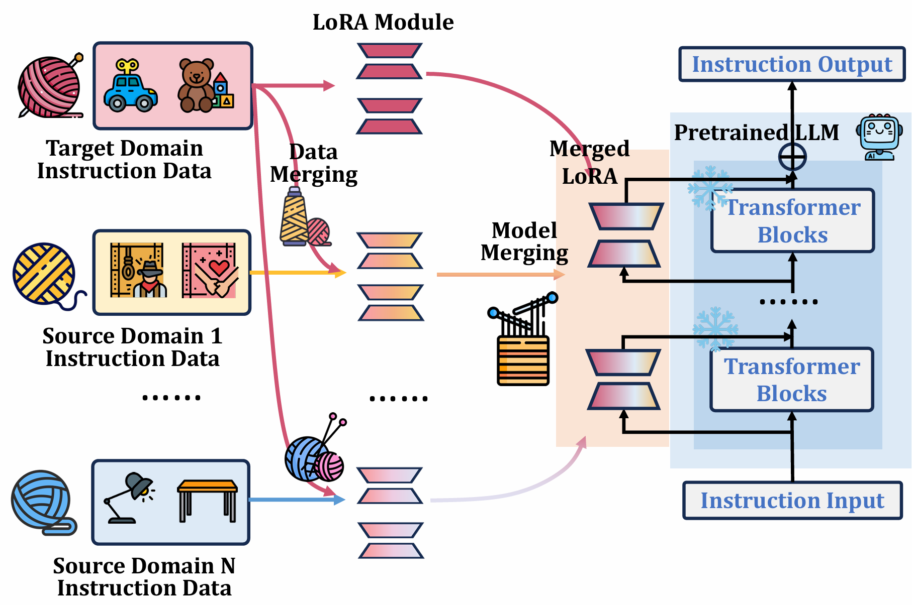

# WeaveRec: LLM-Based Cross-Domain Sequential Recommendation with Negative Transfer Mitigation

## 1. Introduction

WeaveRec aims to enhance the recommendation performance of LLMs on the target domain by leveraging model merging to integrate useful knowledge from source domains with that of the target domain. This approach helps to mitigate the common problem of negative transfer often seen in model merging. As shown in the figure below, WeaveRec trains respective mixed-domain models and merges them with the target-domain-only model to better adapt source knowledge to target distributions. Please note that, WeaveRec is efficient with plug and play, as all target-domain modules and hybrid modules are trained once and hybrid modules are repeatedly used under different settings.

In the following, we will guide you how to use this repository step by step.



## 2. Preparation

Before we begin, taking **beauty, clothing → sports** as an example, we have provided the necessary LoRA checkpoints and the target domain test dataset on [Google Drive](https://drive.google.com/drive/folders/1b5_dQG1Wok9W4pRWZgkTY63E7MkzAti_?usp=drive_link).

### 2.1 Requirements

You can use the following commands to build the environment required for codes.

```bash
conda create -n weaverec python=3.11.9  
conda activate weaverec
sh scripts/env.sh
```

Then, you need to download the pretrained Qwen2-7B-Instruct checkpoint from [Hugging Face](https://huggingface.co/) and save it to the `models/Qwen2-7B-Instruct` directory.

### 2.2 Data Preparation

You can use the following commands to download and process the dataset. Running this script will sequentially process data for all domains independently.

```bash
sh scripts/download_data.sh
sh scripts/make_data.sh
```

After execution, you will find the corresponding training and test files under `/traindata` and `/testdata` respectively. For example, `/traindata/sports.jsonl` and `/testdata/sports.jsonl`. Of course, the test dataset files already exist in the project.

Next, we need to specify the target and source domains to construct the mixed data.

```bash
sh scripts/construct.sh
```

Taking the example of *beauty, clothing → sports*, after executing the script, you will find two datasets for training the hybrid LoRAs under `/traindata/sports_beauty.jsonl` and `/traindata/sports_clothing.jsonl`.

## 3. Training

All LoRA modules are trained using the same training script, `scripts/train_lora.sh`, which leverages LLaMA-Factory to initiate efficient LoRA fine-tuning.

Below is a main script that repeatedly calls train_lora.sh. It can help you conveniently and directly obtain all the necessary target-domain-only LoRAs and hybrid LoRAs.

```bash
sh scripts/train_modules.sh
```

Alternatively, you can manually change the path of the training data within train_lora.sh to obtain different LoRA modules.

Taking the example of *beauty, clothing → sports*, we have provided LoRA checkpoints on [Google Drive](https://drive.google.com/drive/folders/1b5_dQG1Wok9W4pRWZgkTY63E7MkzAti_?usp=drive_link).

```
.
├── save
│   ├── sports
│   │   └── checkpoint-1000
│   │       ├── adapter_config.json
│   │       ├── ...
│   │       ├── ...
│   │       └── adapter_model.safetensors
│   ├── sports_clothing
│   │   └── checkpoint-4170
│   └── sports_beauty
│       └── checkpoint-4950
```

We also provide the target-domain test dataset on [Google Drive](https://drive.google.com/drive/folders/1b5_dQG1Wok9W4pRWZgkTY63E7MkzAti_?usp=drive_link).

```
.
├── save
├── testdata
│   └── sports.jsonl
```

## 4. Model Merging and Test

Of course, you can also skip the previous Step 3 and directly find the required LoRA checkpoints in the `/save` directory of this project to proceed with model merging and inference testing.

```bash
sh scripts/merge_and_test.sh
```

In this script, you'll need to load the required LoRA checkpoint paths and specify the target domain, which is your test dataset. The LLM will then perform inference for each prompt and store all of the outputs in a JSONL file in the `/result` directory. This file will be used for the next step, which is calculating the evaluation metrics.

## 5. Metric

Use the following command to output the metrics.

```bash
sh scripts/metric.sh
```

You'll need to specify the JSONL file with the LLM's outputs and the path to the test dataset. The script will compare the LLM's output with the ground truth from these two files to calculate the metrics.

## 6. Acknowledgements


Our code is based on the implementation of [peft](https://github.com/huggingface/peft), [transformers](https://github.com/huggingface/transformers) and [LLaMA-Factory](https://github.com/hiyouga/LLaMA-Factory).
